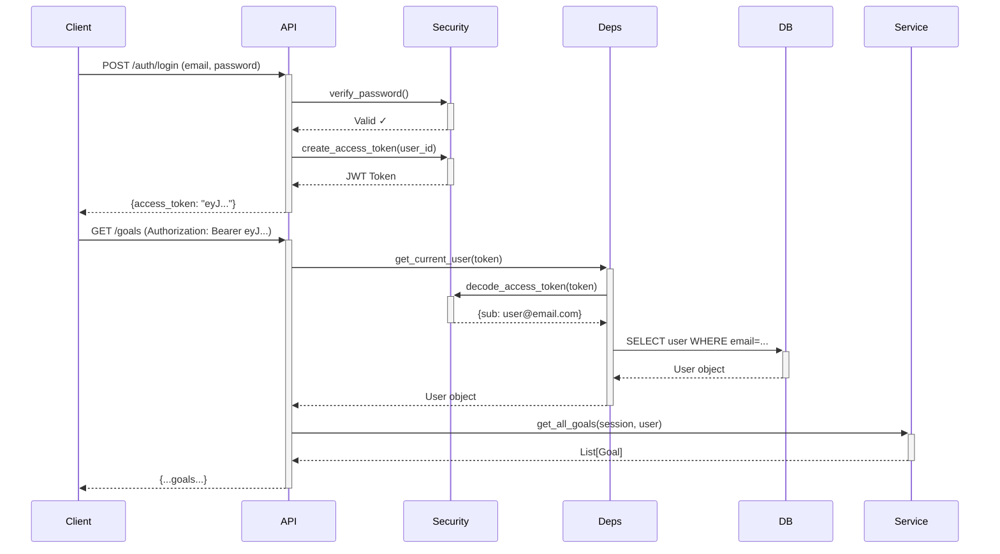
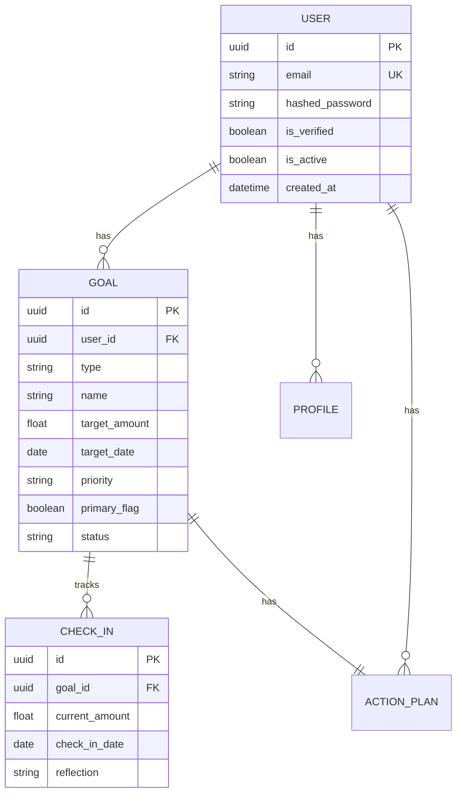

# FinCred Backend Architecture

## Overview

FinCred backend follows a **layered architecture** pattern with clear separation of concerns between API, business logic, and data access layers.

```
┌─────────────────────────────────────────────────────────────┐
│                      Client Applications                     │
│              (Web App, Mobile App, Third-party)              │
└──────────────────────┬───────────────────────────────────────┘
                       │ HTTP/REST
┌──────────────────────▼───────────────────────────────────────┐
│                       API Layer (FastAPI)                     │
│  ┌─────────────┐  ┌──────────────┐  ┌───────────────────┐   │
│  │   Routers   │  │ Dependencies │  │   Middleware      │   │
│  │  (Endpoints)│  │  (Auth, etc) │  │  (Security, etc)  │   │
│  └─────────────┘  └──────────────┘  └───────────────────┘   │
└──────────────────────┬───────────────────────────────────────┘
                       │
┌──────────────────────▼───────────────────────────────────────┐
│                    Service Layer                              │
│  ┌──────────────┐  ┌──────────────┐  ┌──────────────┐       │
│  │ Goal Service │  │ Auth Service │  │ Planning Svc │ ...   │
│  │              │  │              │  │              │       │
│  └──────────────┘  └──────────────┘  └──────────────┘       │
│         Business Logic & Validation                           │
└──────────────────────┬───────────────────────────────────────┘
                       │
┌──────────────────────▼───────────────────────────────────────┐
│                    Database Layer                             │
│  ┌─────────────────┐         ┌──────────────────────┐        │
│  │  SQLModel ORM   │         │   PostgreSQL         │        │
│  │  (Models)       │   ◄───► │   (Database)         │        │
│  └─────────────────┘         └──────────────────────┘        │
└───────────────────────────────────────────────────────────────┘
```

---

## Core Principles

1. **Separation of Concerns** - Each layer has a distinct responsibility
2. **Dependency Injection** - FastAPI's dependency system for loose coupling
3. **Type Safety** - Pydantic for runtime validation, type hints for static analysis
4. **Error Handling** - Custom exception hierarchy with proper HTTP status mapping
5. **Testability** - Layers can be tested independently

---

## Layer Breakdown

### 1. API Layer (`app/api/`)

**Responsibility**: HTTP request/response handling, routing, and validation

**Components:**
- **Routers** (`routers/*`): Define API endpoints and handle HTTP logic
- **Dependencies** (`deps.py`): Reusable dependencies (authentication, pagination)
- **Schemas** (`app/schemas/`): Request/response models (Pydantic)

**Key Files:**
- `app/api/v0/routers/auth.py` - Authentication endpoints
- `app/api/v0/routers/goals.py` - Goal management endpoints
- `app/api/v0/deps.py` - Auth, pagination, DB session dependencies

**Example Flow:**
```python
@router.post("/goals", response_model=GoalRead)
async def create_goal(
    goal_data: GoalCreate,                           # Request validation
    current_user: Annotated[User, Depends(get_current_user)],  # Auth dependency
    session: Annotated[Session, Depends(get_session)]  #  DB session
):
    return create_new_goal(session, current_user, goal_data)  # Call service layer
```

---

### 2. Service Layer (`app/services/`)

**Responsibility**: Business logic, validation, and orchestration

**Purpose:**
- Implement business rules (e.g., max 5 active goals per user)
- Coordinate multiple database operations
- Validate business constraints
- Handle transactions

**Key Services:**
- `goal_service.py` - Goal CRUD and business logic
- `action_plan_service.py` - Action plan generation
- `snapshot_service.py` - Financial snapshot management
- `tracking_service.py` - Progress tracking (check-ins)

**Example:**
```python
def create_new_goal(session: Session, user: User, goal_data: GoalCreate) -> Goal:
    # Business validation
    if _count_active_goals(session, user.id) >= 5:
        raise GoalLimitExceededError(...)
    
    if goal_data.target_date <= date.today():
        raise InvalidGoalDateError(...)
    
    # Create database record
    goal = Goal.model_validate(goal_data, update={"user_id": user.id})
    session.add(goal)
    session.commit()
    session.refresh(goal)
    return goal
```

---

### 3. Database Layer (`app/db/`, `app/models/`)

**Responsibility**: Data persistence and retrieval

**Components:**
- **Models** (`app/models/`): SQLModel database models (ORM)
- **Session Management** (`db/session.py`): Database connection and pooling
- **Migrations** (`alembic/`): Schema versioning

**Key Features:**
- Connection pooling (pool_size=5, max_overflow=10)
- Stale connection detection (pool_pre_ping=True)
- Health check utilities
- Retry logic for transient failures

**Example Model:**
```python
class Goal(SQLModel, table=True):
    __tablename__ = "goals"
    
    id: UUID = Field(default_factory=uuid4, primary_key=True)
    user_id: UUID = Field(foreign_key="users.id", index=True)
    name: str = Field(max_length=100)
    target_amount: float
    target_date: date
    status: str = Field(default="active")
    # ... more fields
```

---

## Cross-Cutting Concerns

### Authentication & Authorization

**Flow:**


**Implementation:**
- JWT tokens (HS256 algorithm)
- Token expiration: 30 minutes
- Password hashing: PBKDF2-HMAC-SHA256
- Bearer token authentication scheme

---

### Error Handling

**Exception Hierarchy:**
```
AppException (Base)
├── AuthenticationError
│   ├── InvalidCredentialsError
│   └── TokenExpiredError
├── AuthorizationError
├── ValidationError
│   ├── InvalidGoalDateError
│   ├── NoFieldsToUpdateError
│   └── EmailAlreadyExistsError
├── ResourceNotFoundError
├── ConflictError
│   └── GoalLimitExceededError
└── DatabaseError
```

**Exception to HTTP Mapping:**
- `AuthenticationError` → 401 Unauthorized
- `AuthorizationError` → 403 Forbidden
- `ValidationError` → 400 Bad Request
- `ResourceNotFoundError` → 404 Not Found
- `ConflictError` → 409 Conflict
- `DatabaseError` → 500 Internal Server Error

**Global Exception Handler:**
Custom exception handler in `app/core/exception_handlers.py` catches all `AppException` instances and returns standardized JSON responses:

```json
{
  "success": false,
  "error": "Goal limit exceeded",
  "error_code": "GOAL_LIMIT_EXCEEDED",
  "details": {
    "current_count": 5,
    "max_count": 5
  }
}
```

---

### Logging & Monitoring

**Structured Logging:**
- Console format (development): Human-readable
- JSON format (production): Machine-parseable
- Request ID correlation for tracing
- Log levels: DEBUG, INFO, WARNING, ERROR, CRITICAL

**Middleware:**
- Request ID middleware (X-Request-ID header)
- Request timing middleware (performance tracking)
- Security headers middleware (OWASP best practices)

**Log Example:**
```json
{
  "timestamp": "2026-02-04T13:15:00Z",
  "level": "INFO",
  "logger": "app.services.goal_service",
  "message": "Goal created successfully",
  "request_id": "abc123",
  "user_id": "uuid-...",
  "goal_id": "uuid-..."
}
```

---

### Database Schema

**Core Entities:**



**Key Relationships:**
- User 1:M Goals
- Goal 1:M Check-ins
- User 1:1 Profile
- Goal 1:1 Action Plan

---

## Configuration Management

**Environment-based Configuration:**
- `app/core/config.py` using Pydantic Settings
- Validation at startup (fail fast)
- Type-safe configuration access

**Configuration Layers:**
1. `.env` file (local overrides)
2. Environment variables (deployment)
3. Default values (where safe)

**Critical Settings:**
- `JWT_SECRET_KEY` - **REQUIRED**, no default
- `SQLALCHEMY_DATABASE_URI` - Database connection
- `ENV` - Environment (development/staging/production)
- `CORS_ORIGINS` - Allowed origins for CORS

---

## Security Architecture

**Defense in Depth:**
1. **Input Validation** - Pydantic schemas at API layer
2. **Authentication** - JWT bearer tokens
3. **Authorization** - User ownership checks in services
4. **SQL Injection Protection** - ORM (SQLModel) parameterized queries
5. **Password Security** - Salted hashes (PBKDF2)
6. **Security Headers** - OWASP recommended headers
7. **CORS** - Configured allowed origins

**Security Headers Applied:**
- `X-Content-Type-Options: nosniff`
- `X-Frame-Options: DENY`
- `X-XSS-Protection: 1; mode=block`
- `Strict-Transport-Security` (HSTS)

---

## Design Decisions & Rationale

### Why FastAPI?
- **Performance**: Async support, one of the fastest Python frameworks
- **Type Safety**: Built-in Pydantic validation
- **Auto-documentation**: OpenAPI/Swagger UI generation
- **Modern**: Python 3.11+ type hints, async/await

### Why SQLModel?
- **Type Safety**: Combines SQLAlchemy + Pydantic
- **DRY**: Single model for DB and API schemas
- **Developer Experience**: Better IDE support

### Why Layered Architecture?
- **Testability**: Can test business logic without HTTP
- **Maintainability**: Clear separation of concerns
- **Scalability**: Easy to add features without impacting other layers

### Why Custom Exceptions?
- **Control**: Precise HTTP status code mapping
- **Debugging**: Clear error context
- **Security**: Prevent information leakage

### Why Connection Pooling?
- **Performance**: Reuse connections, avoid overhead
- **Scalability**: Handle concurrent requests efficiently
- **Reliability**: Stale connection detection

---

## Testing Strategy

**Test Pyramid:**
```
        /\
       /  \    E2E (Future)
      /────\
     / Int  \   Integration Tests (17 tests)
    /────────\
   /   Unit   \  Unit Tests (38 tests)
  /────────────\
```

**Layers:**
1. **Unit Tests** (`tests/unit/`) - Fast, isolated, no DB
   - Security functions (password hashing, JWT)
   - Custom exceptions
   - Validators

2. **Integration Tests** (`tests/integration/`) - With DB
   - Service layer with real database
   - API endpoints with test client
   - Health checks

**Test Infrastructure:**
- In-memory SQLite for tests (fast, isolated)
- Pytest fixtures for DB setup/teardown
- Custom markers (`@pytest.mark.unit`, `@pytest.mark.goals`)
- Test coverage tracking

---

## Performance Considerations

**Database:**
- Connection pooling (5 connections, 10 overflow)
- Index on foreign keys (user_id, goal_id)
- Query optimization in services
- Pagination for large result sets

**API:**
- Async endpoints where beneficial
- Response model validation (Pydantic is fast)
- Dependency caching potential (future)

**Future Optimizations:**
- Redis caching for user sessions
- Background tasks for emails
- Query result caching
- CDN for static assets

---

## Deployment Architecture

**Production Stack:**
```
┌─────────────────┐
│   Load Balancer │ (nginx, AWS ALB)
└────────┬────────┘
         │
    ┌────┴────┐
    │  Web    │  Web Server
    │ Server  │  (uvicorn workers)
    │ (x3)    │
    └────┬────┘
         │
    ┌────▼────────┐
    │  PostgreSQL │  Primary Database
    │  (Main)     │  (with read replicas)
    └─────────────┘
```

**Containerization:**
- Docker for application
- Docker Compose for local development
- Kubernetes for production (future)

---

## Next Steps & Roadmap

**Immediate:**
- [ ] Add Redis for session caching
- [ ] Implement background job queue (Celery)
- [ ] Add rate limiting per user
- [ ] Monitoring (Prometheus/Grafana)

**Future:**
- [ ] GraphQL API option
- [ ] WebSocket for real-time updates
- [ ] Multi-tenancy support
- [ ] Event sourcing for audit trail

---

## Additional Resources

- [Development Guide](./DEVELOPMENT.md) - Setup and development workflow
- [API Usage Guide](./API_GUIDE.md) - API examples and patterns
- [Contributing Guidelines](../CONTRIBUTING.md) - How to contribute
